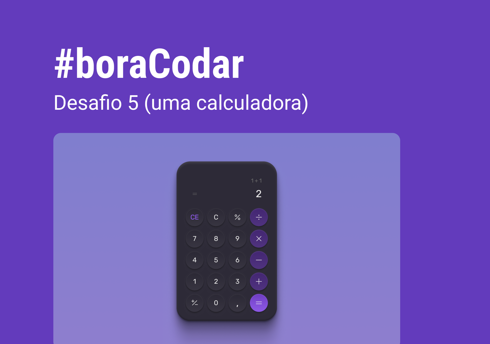

  

## 💻 Projeto

Desafio #BoraCodar#5.

## ✨ Tecnologia

- [TypeScript](https://www.typescriptlang.org/)
- [React](https://reactjs.org/)
- [Tailwindcss](https://tailwindcss.com/)
- [Nextjs](https://nextjs.org/)

## 🔖 Layout

Podes visualizar o layout do projeto através do link abaixo:

- [Layout](https://www.figma.com/community/file/1202607074523509182/%23boraCodar---Desafio-5)

Lembrando que precisas de ter uma conta no [Figma](http://figma.com/).

  Feito com 💜 by Rocketseat

